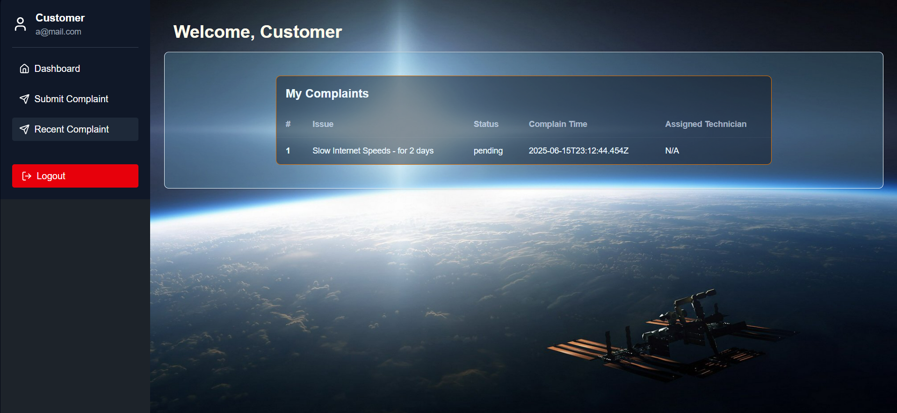
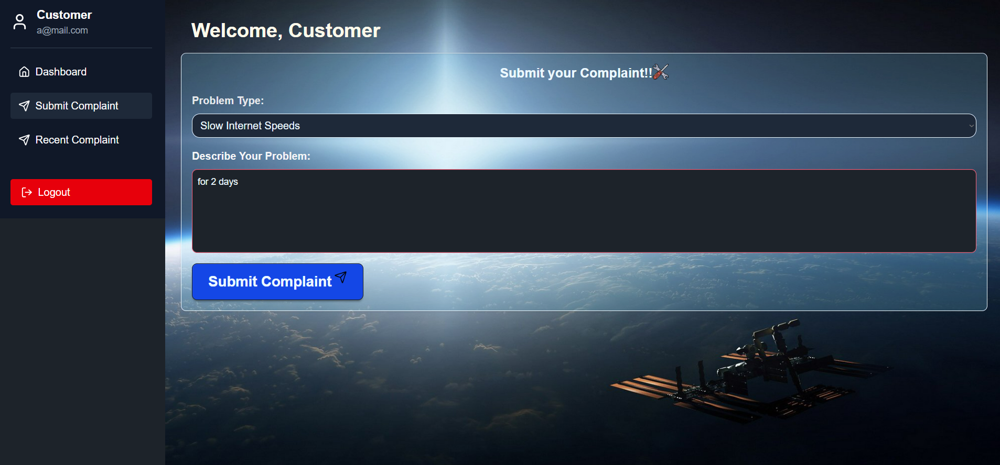
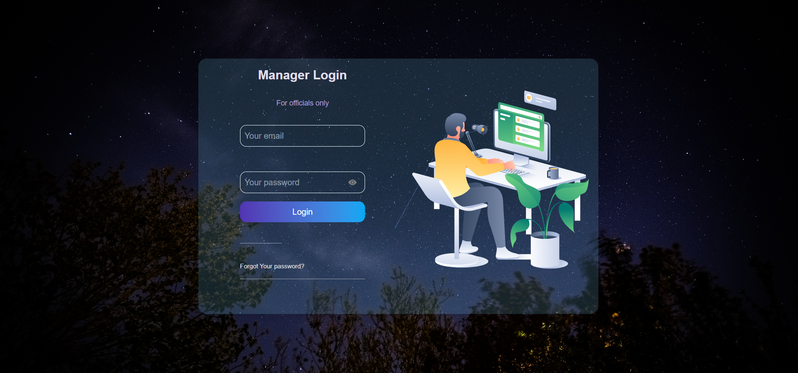
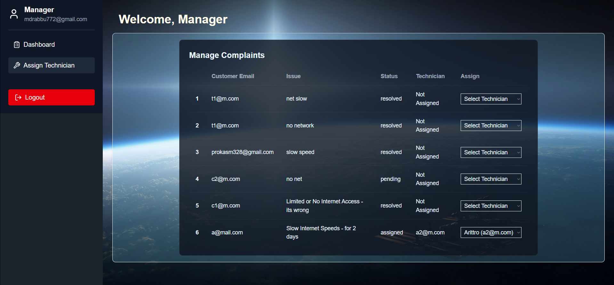
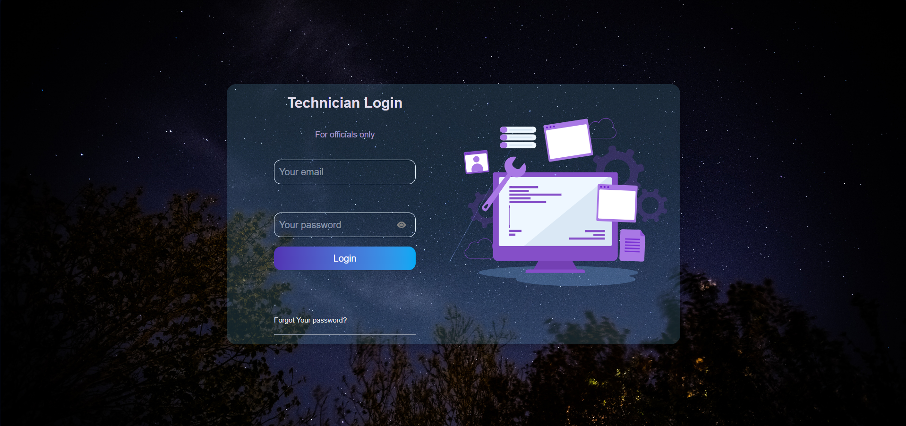
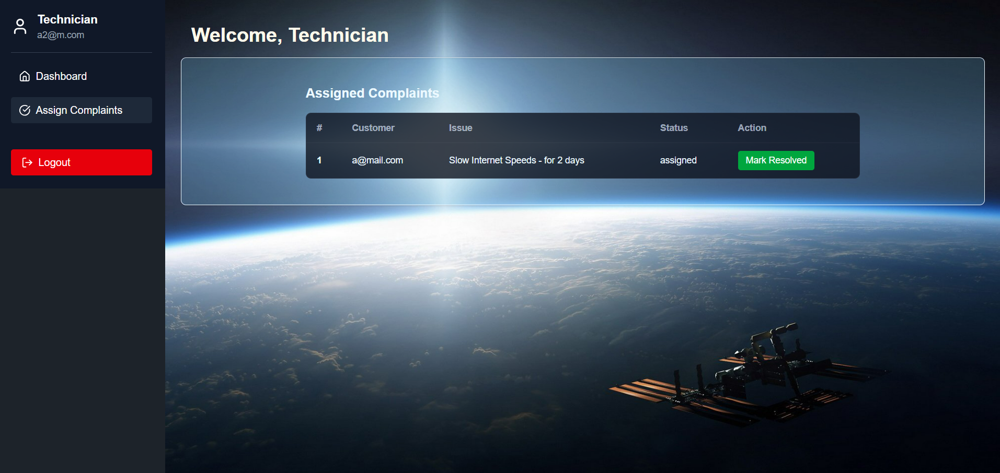

# AstroLink

## A ROLE-BASED ISP Complaint Management System Web Application using MERN stack

---

## 🚀 Features

### 👤 Customer
- Register and log in.
- Submit a complaint with problem type and description.
- View recent complaints and their status.

### 🛠️ Technician
- Log in securely.
- View assigned complaints.
- Mark complaints as **resolved**.

### 🧑‍💼 Manager
- View all complaints.
- Assign technicians to complaints.
- Monitor complaint progress.

---

## Technologies Used

- **Frontend**: React.js + Vite + Tailwind CSS
- **Backend**: Node.js + Express.js
- **Database**: MongoDB
- **Authentication**: Firebase Auth
- **Icons/UI**: Lucide Icons, DaisyUI, SweetAlert2

---

### 📸 Screenshots

#### 🔐Customer Login Page  

#### 🔐Customer Complaint Page  

#### 🔐Customer Complaint Records  

#### 👨‍💼 Manager Login Page  

#### 👨‍💼 Manager Assigning Technician Page  

#### 👷 Technician Login Page  

#### 👷 Technician's Assigned Page  

---

## 📦 Installation & Run Locally

### Prerequisites:
- Node.js
- MongoDB installed or MongoDB Atlas
- Firebase Project for Authentication

---

## Getting Started

1. Clone the repository
2. Install dependencies with `npm install`
3. Set up environment variables
4. Run the development server with `npm start`

---

## Learnings

- Implemented role-based login and dynamic dashboards.
- Built RESTful APIs with Express.
- Integrated Firebase authentication.
- Performed real-time state updates with MongoDB & React hooks.

Feel free to contribute or raise issues!